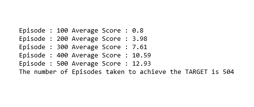

# Report

# About the Code :

1 The agent is a Deep Neural Network with the following architecture

First layer	37 Neurons 	Input Layer
Second layer	64 Neurons	First Hidden Layer	Relu
Third layer 	64 Neurons 	Second Hidden Layer	Relu
Final layer	4 Neurons	Output layer

since the env is giving us state information we dont need a convolutional layer at the beginning.

# An Epsillon Greedy ACTION SELECTION policy is used. These are the different ways tested and commited to the best one

E = 1, E_decay = 0.001, Emin = 0.05 and decay rule is LINEAR 	E = E - E_decay. The result is

E = 1, E_decay = 0.995, Emin = 0.05 and decay rule is Exponential	E = E * E_decay. The result is

# Hyperparameters

replay buffer size (BUFFER_SIZE): 	int(1e5) \n
minibatch size (BATCH_SIZE) : 		64 \n
discount factor (GAMMA) : 		0.99 		\n
soft update of target parameters(TAU): 	1e-3 		\n
learning rate (LR) : 			5e-4 \n
network updates (UPDATE_EVERY) : 	4 	\n

# Plot of Rewards

# Result

The agent was able to reach the goal of average score 13 in 504 episodes

# Ideas for Future work 

a. Train the agent without giving the state information rather providing pixels directly.
b. Improve the dqn with the extensions like : Double dqn, Dueling dqn and making the replay buffer to be Prioritized experience replay.
