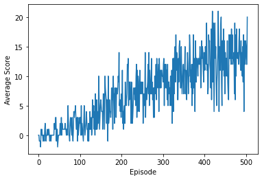

# Report

# About the Code :

1 The agent is a Deep Neural Network with the following architecture

First layer	37 Neurons 	Input Layer

Second layer	64 Neurons	First Hidden Layer	Relu

Third layer 	64 Neurons 	Second Hidden Layer	Relu

Final layer	4 Neurons	Output layer

since the environment is giving us state information we dont need a convolutional layer at the beginning.

# An Epsillon Greedy ACTION SELECTION policy is used.
This rule is make the balance of EXPLORATION and EXPLOITATION for the agent while learning.

E = 1

E_decay = 0.995

Emin = 0.05 

decay rule is Exponential	E = E * E_decay.

# Hyperparameters

replay buffer size (BUFFER_SIZE): 	int(1e5)

minibatch size (BATCH_SIZE) : 		64 

discount factor (GAMMA) : 		0.99 		

soft update of target parameters(TAU): 	1e-3 	

learning rate (LR) : 			5e-4 

network updates (UPDATE_EVERY) : 	4 	

# Plot of Rewards

# Result

The agent was able to reach the goal of average score 13 in 504 episodes.

# Ideas for Future work 

a. Train the agent without giving the state information rather providing pixels directly.

b. Improve the dqn with the extensions like :

    Double dqn, 

    Dueling dqn and 
    
    Making the replay buffer to be Prioritized experience replay.
